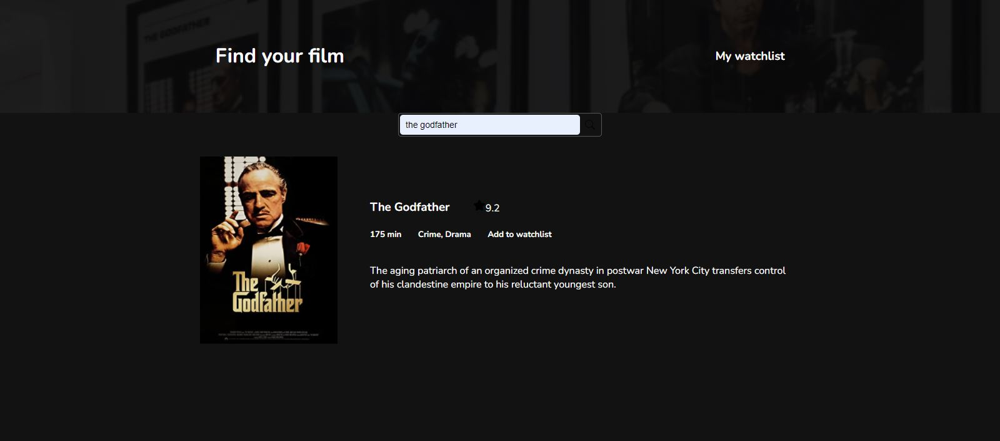
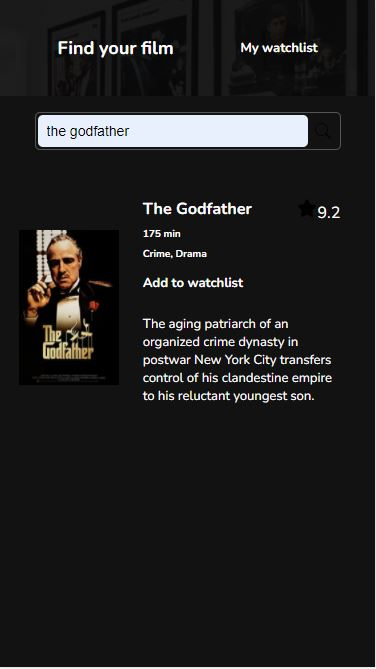

# Movie Watchlist with OMDB API

An awesome Movie Watchlist app, which allows users to search for movies by title, see the description, rating, runtime and genre of each movie and save any movie to their watchlist. It's made as a Solo project for [Frontend Career Path](https://scrimba.com/learn/frontend), with asynchronous JS and [Open Movie Database API](http://www.omdbapi.com/), which enables searching through the movie database by movie title.

## Table of contents

- [Overview](#overview)
  - [Screenshot](#screenshot)
  - [Links](#links)
- [Process](#process)
  - [Built with](#built-with)
- [Author](#author)

## Overview

Users should be able to:
- search for movies by their name
- see the description, rating, poster image, genre and runtime of each movie
- save movies to their own watchlist
- view the movies in watchlist

### Screenshot

Desktop and mobile design of Movie Watchlist.

### Links

- Live Site URL: [Movie Watchlist](https://jelenkoo10.github.io/movie_watchlist/)

## Process

### Built with

- Semantic HTML5 markup
- Flexbox
- Desktop-first workflow
- Asynchronous JavaScript
- localStorage
- [React](https://reactjs.org/) - JS library

## Author

- GitHub - [https://github.com/jelenkoo10](https://github.com/jelenkoo10)
- Frontend Mentor - [@jelenkoo10](https://www.frontendmentor.io/profile/jelenkoo10)
- LinkedIn - [Veljko Jelenković](https://www.linkedin.com/in/veljko-jelenkovi%C4%87-182981250/)